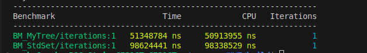

# HWT
Для работы с моей программой вам понадобятся
- CMake of version 3.20 (or higher)
- python3
- python3-venv
- pip

# Установка
Склонируйте репозиторий, перейдите в папку с ним.
Сборка проекта:

## Установите необходимые зависимости:
```sh
python3 -m venv .venv
source .venv/bin/activate
pip3 install -r requirements.txt
```
## Соберите проект
```sh
conan install . --output-folder=third_party --build=missing -s compiler.cppstd=20
cmake -B build -DCMAKE_BUILD_TYPE=Release -DCMAKE_TOOLCHAIN_FILE=./third_party/conan_toolchain.cmake
cd build/
make
```
# Как с этим работать 

Результат работы моего AVL дерева сравнивается в результатом работы std::set.
## Мои данные для тестов :
Все тесты лежат в корневой папке в "test/e2e_tests/data". 
Чтобы запустить мои тесты, в папке build напишите :
```sh
ctest
```

## Нарисовать дерево
Чтобы увидеть нарисованное дерево, в папке build напишите:
```sh
 ./hwt --dot DOT_FILE_NAME --output OUTPUT_FILE_NAME  *
```
подставьте имена своих файлов вместо DOT_FILE_NAME и OUTPUT_FILE_NAME.

Пример построенного дерева:
 

## Свои данные
Чтобы протестировать свои данные, напишите 
```sh
./hwt *
```
где вместо * укажите либо "< my_file_name.txt", либо ничего не указывайте и нажмите Enter, после чего вводите свои данные в формате моих тестов.

## Benchmark :
Чтобы запустить бенчмарки, перейдите в папку "build" и напишите :
```sh
./benchmark/hwt_benchmark
```
 Вот пример для данных из второго теста: 
 
